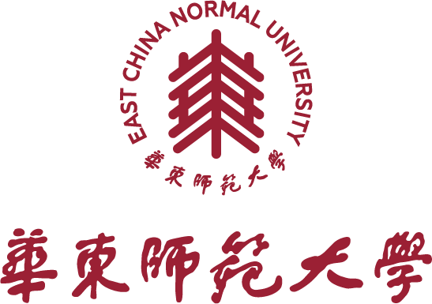

------


# 基于Rust与xv6的操作系统教学方案设计与实现


## 比赛信息

2025年全国大学生计算机系统能力大赛 - 操作系统设计赛(全国) - OS功能挑战赛道

- **赛题：** proj0 - 面向操作系统课程的操作系统竞赛和实验 - 题目二：适合本校特点的实验指导教程
- **队名：** SEIOS
- **院校：** 华东师范大学
- **指导老师：** 郭建，张敏
- **参赛队员：** 郑子攸，叶晨皓，周恒如

------

## 提交内容

- **项目说明文档：** 决赛文档 - 基于Rust与xv6的操作系统教学方案设计与实现.pdf
- **项目汇报PPT：** 决赛PPT - 基于Rust与xv6的操作系统教学方案设计与实现.pptx
- **项目演示视频：** [决赛视频](https://pan.baidu.com/s/1hMQOC2ZkRO4_yzTtTfr8pg?pwd=9eek)

------

## 项目简介

- Rust语言是目前操作系统研究的重要方向，但现有的操作系统课程以C语言实现为主
- 本项目基于[xv6-riscv-rust]([Jaic1/xv6-riscv-rust](https://github.com/Jaic1/xv6-riscv-rust))实现了一套操作系统实践课程，主要完成了如下工作
  - 系统内核架构分析与核心模块注释编写
  - 使用Rust语言重写用户程序及测试用例，实现用户及内核线程库
  - 设计与移植12个学生实验，实现自动化评测方案
  - 编写实验指导手册，参考实现以及实验阅读材料
- 对内核核心模块（内存管理，进程管理，文件系统）编写了完善的文档注释
- 使用Rust重写部分xv6的用户程序以及测试用例，计划后续使用Rust重写所有测试用例
- 基于Rust语言实现了用户线程库，用于设计多线程实验，填补xv6中无法进行多线程实验的空缺
- 移植xv6的评测方案，实现了Rust环境下的学生实验全自动评测
- 参考xv6的学生实验，已完成12个实验的移植与实验指导手册及参考实现的编写

------

## 仓库说明

- **实验手册/参考实现/阅读材料：** 位于本仓库main分支的handbook文件夹下
- 本项目将各个实验独立处理，实现不同实验间的解耦，需要分割各个实验的代码到不同分支
  - 帮助学生单独进行每一个实验，而不依赖其他实验结果
  - main分支仅用作代码展示与报告提交
  
- 可执行代码位于其他分支中，可使用`git checkout 分支名称`进行查看
  - **comment分支：** 包含完整的内核代码文档注释
  - **lab-util分支：** 包含学生实验1-4的评测脚本，参考实现等
  - **lab-syscall分支：** 包含学生实验5，6的评测脚本，参考实现等
  - **lab-pagetable分支：** 包含学生实验7，8的评测脚本，参考实现等
  - **lab-trap分支：** 包含学生实验9，10的评测脚本，参考实现等
  - **lab-lazyalloc分支：** 包含学生实验11的评测脚本，参考实现等
  - **lab-schedule分支：** 包含学生实验12的评测脚本，参考实现等
  - **lab-thread分支：** 包含使用Rust语言实现的用户程序，用户线程库，内核线程库及其实验
  
- 执行`make qemu`可以启动基于Rust语言的系统内核
- 执行`make asm`可以输出系统内核汇编代码，用于调式
- 执行`make qemu-gdb`可以启动系统内核并连接GDB，用于调试
- 执行`make grade`可以全自动编译并评测实验结构，查看分数
- 仓库结构如下

```
.
├── grade                     # 自动化测试与评分脚本，负责运行测试用例并评估结果
├── handbook                  # 实验指导手册，包含实验的指导手册，参考实现以及阅读材料
├── include                   # 公共头文件目录，定义系统调用号、结构体、常量等，供C实现的用户程序共享
├── kernel                    # 操作系统内核顶层目录，包含内核核心代码，参考xv6-riscv-rust
│   └── src                   # 内核源代码主目录
│       ├── asm               # 汇编代码目录，实现启动流程、上下文切换等底层功能
│       ├── consts            # 常量定义模块，含内存布局、页大小、中断号等关键宏
│       ├── driver            # 驱动程序模块，如控制台、串口、磁盘驱动等硬件接口
│       ├── fs                # 文件系统模块，实现inode、块管理、目录操作等
│       ├── ld                # 链接脚本目录，定义内核加载地址与段布局
│       ├── mm                # 内存管理模块，含页表、分配器、虚拟内存等
│       ├── process           # 进程与调度管理模块，处理线程切换、状态等
│       └── register          # RISC-V寄存器和陷入上下文相关定义
├── mkfs                      # 文件系统镜像生成工具，用于将用户程序打包进文件系统
├── user                      # 用户态C语言程序目录，包含标准实验中的用户测试代码，参考xv6用户程序
└── user_rust                 # 用户态Rust程序目录，使用Rust实现用户程序与测试逻辑
    ├── src                   # Rust用户程序源代码目录
    │   ├── bin               # 可执行Rust用户程序目录，每个程序对应一个二进制
    │   └── thread            # Rust用户线程库，提供线程创建、调度、同步等支持
    └── syscall_riscv         # Rust用户态系统调用实现目录
        └── src               # 具体系统调用封装代码，实现与内核的接口交互
```

---

## 目标

- 填补基于Rust语言的教学操作系统课程目前存在的空白，提供一种同时学习Rust与操作系统的可行路径
- 为系统内核中的所有函数添加文档注释，实现注释100%覆盖，提升代码的可读性
- 针对操作系统的不同部分设计难度由浅入深的实验题，帮助学生逐步学习Rust语言与操作系统
- 设计完善的测试用例与测试脚本，实现自动化评测，简化实验检查步骤并提高评分公平性
- 编写实验指导手册，提供每一个实验题的题干、提示、参考实现以及详细的实验解答

------

## 参考资料

[MIT - 6.828（xv6）](https://pdos.csail.mit.edu/6.828/2020/index.html)

[清华大学 - rCore-Tutorial-Book 第三版](https://rcore-os.cn/rCore-Tutorial-Book-v3/index.html)

[中科院软件所 - 循序渐进，学习开发一个 RISC-V 上的操作系统](https://gitee.com/unicornx/riscv-operating-system-mooc)

[南京大学 - 操作系统：设计与实现](https://jyywiki.cn/OS/2022/index.html)

[华中科技大学 - 操作系统实验（riscv-pke）](https://gitee.com/hustos/pke-doc)

[xv6-riscv-rust]([Jaic1/xv6-riscv-rust](https://github.com/Jaic1/xv6-riscv-rust))

[Ko-oK-OS](https://github.com/Ko-oK-OS/xv6-rust)

[mit-pdos/xv6-riscv: Xv6 for RISC-V](https://github.com/mit-pdos/xv6-riscv)

[Stephen Marz: Blog](https://osblog.stephenmarz.com/index.html)

[OSDev Wiki](https://wiki.osdev.org/Main_Page)

[Writing an OS in Rust](https://os.phil-opp.com/zh-CN/)